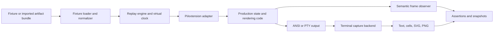

# pi-ui-lab — Robust Implementation Plan

`pi-ui-lab` should be a deterministic replay engine first, a terminal capture and regression suite second, and an interactive debugger third.

The central architectural rule is:

> Fixtures describe inputs and time. The real extension code derives UI state. Tests must not encode precomputed UI frames as their source of truth.

This prevents the lab from becoming a second implementation of the extension it is supposed to test.

## 1. Product boundaries

### Goals

`pi-ui-lab` will:

- Replay synthetic timelines and imported Pi/session artifacts deterministically.
- Exercise the production extension’s reducers, polling logic, recovery logic, and renderers.
- Capture terminal output as ANSI, normalized text, cells, SVG, and PNG.
- Assert semantic UI state independently of screenshot rendering.
- Test width/theme matrices without tmux, a model, or wall-clock waits.
- Reproduce bugs from portable fixture bundles.
- Eventually expose the same replay session through `/ui-lab`.

### Non-goals

The first version will not:

- Reimplement Pi’s entire session runtime.
- Simulate model reasoning or live sub-agent processes.
- Guarantee pixel equivalence across fonts, operating systems, or terminal applications.
- Use PNG comparison as the primary correctness signal.
- Make the interactive inspector a prerequisite for CI usefulness.
- Depend on tmux or a live artifact producer.

## 2. Architectural decisions

### A. Separate replay state from terminal capture

Use three distinct layers:

1. **Replay engine**  
   Owns virtual time, fixture events, poll scheduling, reloads, and deterministic execution.

2. **System-under-test adapter**  
   Sends replay inputs through the real extension/session code and reads its observable UI state.

3. **Capture backend**  
   Observes the resulting ANSI/cell output and optionally produces images.

This makes it possible to distinguish:

- A state/recovery bug.
- A renderer bug.
- A terminal-emulation or screenshot bug.

### B. Provide two execution modes

**In-process mode**

- Fast default for semantic tests.
- Uses the real extension runner and production reducers/renderers.
- No PTY or subprocess unless required.
- Suitable for most CI matrix coverage.

The current `@gaodes/pi-test-harness` runs real Pi extension hooks while replacing model calls, making it a plausible integration layer, but it should be proven in a spike before becoming mandatory. [Pi package documentation](https://pi.dev/packages/%40gaodes/pi-test-harness)

**Process mode**

- Launches the real Pi CLI in a PTY.
- Exercises terminal initialization, screen updates, key handling, and resize behavior.
- Used for a smaller set of high-value conformance tests.

Termless already exposes cells, colors, cursor state, resizing, PTY execution, SVG, and PNG capture, so it should be the default capture candidate. [Termless documentation](https://termless.dev/)

Ptywright should initially be optional. It is useful if Termless’s process control or transcript workflow proves insufficient, but adopting both immediately would create overlapping abstractions. [Ptywright reference](https://utensils.io/ptywright/reference/)

`pi-shot` should remain an experimental adapter until its API, maintenance status, and headless behavior are verified. It was not discoverable as a documented public dependency during validation.

### C. Treat semantic state as a first-class artifact

Every rendered frame should expose both terminal data and domain-specific state:

```ts
interface ReplayFrame {
  index: number;
  timeMs: number;
  cause: FrameCause;
  viewport: Viewport;
  theme: ThemeRef;

  ui: {
    footer: FooterState;
    widgets: WidgetState[];
    notifications: NotificationState[];
    toolRenders: ToolRenderState[];
  };

  recovery: {
    cursors: Record<string, string | number | null>;
    processedReceipts: string[];
    artifactEvents: ArtifactEvent[];
  };

  terminal?: {
    ansi: string;
    text: string;
    cells: CellGrid;
    cursor: CursorState;
    overflow: OverflowReport;
  };
}
```

Semantic assertions should operate on `ui` and `recovery`. Terminal assertions should operate on `terminal`.

## 3. Proposed system flow



## 4. Determinism contract

The replay engine needs an explicit contract rather than merely replacing `Date.now()`.

### Virtual time

Expose a clock interface to production polling code:

```ts
interface Clock {
  now(): number;
  setTimeout(callback: () => void, delayMs: number): TimerHandle;
  clearTimeout(handle: TimerHandle): void;
}
```

Production uses a real-clock implementation. Tests inject `VirtualClock`.

### Event ordering

For events sharing a timestamp, define stable ordering:

1. External fixture events, in file order.
2. Filesystem/artifact visibility changes.
3. Scheduled timers.
4. Poll tick.
5. Notification delivery.
6. Render/frame capture.

Each frame records its cause, such as `fixture_event`, `poll`, `reload`, `resize`, or `theme_change`.

### Advancing time

Support three operations:

- `step()` — execute the next scheduled action.
- `advanceTo(timeMs)` — execute everything up to a timestamp.
- `runUntilIdle()` — stop when no events or timers remain.

Add guards for:

- Maximum steps.
- Maximum virtual duration.
- Timer loops scheduled at the same timestamp.
- Events timestamped before the current virtual time.

### Reload semantics

A `reload` event must create a new runtime instance while preserving only declared persisted state. This is critical: resetting an in-memory object is not a valid recovery test.

The fixture should declare which stores survive reload:

```json
{
  "at": 100000,
  "type": "reload",
  "preserve": ["session", "artifacts", "state"]
}
```

## 5. Fixture specification

Version fixtures from the beginning:

```json
{
  "$schema": "https://example.invalid/pi-ui-lab/fixture.schema.json",
  "version": 1,
  "name": "recovered-mixed-agents",
  "description": "Completed output is delivered once after reload.",
  "viewport": { "cols": 100, "rows": 30 },
  "theme": "dark",
  "pollIntervalMs": 1000,
  "timeline": []
}
```

### Requirements

- Validate with JSON Schema before replay.
- Resolve imported paths relative to the fixture file.
- Reject unknown event types by default.
- Allow an explicit compatibility mode for future schema migrations.
- Normalize imported files into the same internal event model as synthetic fixtures.
- Copy imported data into a temporary sandbox before replay.
- Never mutate source fixtures or real session artifacts.
- Support redaction of secrets and machine-specific paths when creating fixtures.

### Recommended event types

- `session_start`
- `subagent_started`
- `activity`
- `waiting`
- `done`
- `failed`
- `workflow_updated`
- `artifact_created`
- `artifact_updated`
- `state_written`
- `poll`
- `reload`
- `resize`
- `theme_changed`
- `key`
- `checkpoint`

Avoid putting expected UI strings into events. Expectations belong in tests or named checkpoints.

## 6. CLI contract

```text
pi-ui-lab replay <fixture>
  --at <time|checkpoint>
  --format text|ansi|json
  --cols <number>
  --rows <number>
  --theme <name>
  --output <path>

pi-ui-lab screenshot <fixture>
  --at <time|checkpoint>
  --format svg|png
  --backend termless|pi-shot
  --output <path>

pi-ui-lab test [patterns...]
  --update
  --matrix
  --backend in-process|pty
  --reporter pretty|json|junit

pi-ui-lab inspect <fixture>

pi-ui-lab fixture import
  --session <session.jsonl>
  --events <events.ndjson>
  --state <subagentura-state.json>
  --artifacts <directory>
  --output <fixture-directory>

pi-ui-lab doctor
```

`doctor` should report Pi compatibility, optional backends, fonts/image libraries, and whether PTY screenshots can run.

Suggested exit codes:

- `0`: success
- `1`: assertion or snapshot mismatch
- `2`: invalid fixture or CLI usage
- `3`: unavailable backend/dependency
- `4`: replay/runtime failure

## 7. Assertion model

Keep three assertion classes separate.

### Semantic

- `toContainText`
- `toHaveStatus`
- `toHaveWidgetRows`
- `toHaveNotification`
- `toHaveNotificationCount`
- `toHaveCursor`
- `toHaveProcessedReceipt`
- `toHaveArtifactEvent`

### Terminal structure

- `toHaveNoHorizontalOverflow`
- `toHaveNoVerticalCollision`
- `toFitViewport`
- `toHaveVisibleText`
- `toHaveDistinctRegions`
- `toHaveValidCursor`
- `toHaveNoUnexpectedScrollback`

Overflow must be cell-aware, including wide Unicode characters and continuation cells. Termless supports cell-level terminal inspection and multiple emulator backends, which is preferable to measuring JavaScript string length. [Backend capability documentation](https://termless.dev/guide/backends.html)

### Visual

- `toMatchTextSnapshot`
- `toMatchCellSnapshot`
- `toMatchScreenshot`

PNG comparison should allow configurable tolerances and produce:

- Expected image.
- Actual image.
- Diff image.
- Semantic/cell diff.
- Replay command needed to reproduce the failure.

## 8. Delivery phases

### Phase 0 — Dependency and integration spike

Deliver a short decision record proving:

- A minimal extension loads in-process.
- Production UI state can be observed without copying renderer logic.
- Pi can be started in a PTY with fixed dimensions.
- ANSI can be captured into a cell grid.
- SVG and PNG can be generated headlessly.
- A fake clock reaches the production poller.

Exit gate: one synthetic “running agent” fixture renders through both in-process and process paths.

### Phase 1 — Deterministic replay core

Implement:

- Versioned fixture schema.
- Fixture validation and path resolution.
- Virtual clock and deterministic scheduler.
- Canonical event normalization.
- Replay checkpoints.
- Reload with persisted-state reconstruction.
- JSON and clean-text frame output.

Exit gate: identical input produces byte-identical JSON and text snapshots across repeated runs.

### Phase 2 — Semantic state and recovery

Implement:

- Production state observer.
- Footer, widget, notification, cursor, and artifact frame models.
- Duplicate receipt suppression checks.
- Recovery and inject-cap fixtures.
- Semantic matchers.

Exit gate: recovery, duplicate-delivery, stale, failed, and completed-with-errors scenarios pass without terminal screenshots.

### Phase 3 — Terminal capture

Implement:

- ANSI capture.
- Cell-grid normalization.
- Resize behavior.
- Overflow and collision reports.
- SVG/PNG generation.
- Snapshot update and diff artifacts.

Exit gate: the real Pi TUI is captured at 60 and 100 columns in headless CI.

### Phase 4 — Matrix runner and CI

Implement:

- Width/theme matrix expansion.
- Test sharding.
- JUnit and JSON reports.
- Snapshot manifest containing platform and dependency metadata.
- Failure artifact bundle.
- Separate fast and conformance suites.

Suggested CI tiers:

- Every change: semantic tests plus text/cell snapshots.
- Main branch: full width/theme matrix.
- Scheduled or release: PTY screenshots and optional multi-terminal backends.

### Phase 5 — Standalone inspector

Implement `pi-ui-lab inspect` using the same replay session API:

- Frame stepping.
- Play/pause.
- Width/theme cycling.
- Event and state panels.
- Screenshot saving.
- Jump to checkpoint/time.
- Search by agent, event, or notification.

### Phase 6 — Pi `/ui-lab` command

Add the Pi extension only after the standalone inspector is stable. The command should be a thin UI shell over the same inspector controller, not a separate replay implementation.

## 9. Initial fixture suite

Group fixtures by behavior rather than making every width/theme permutation a separate file.

| Group      | Scenarios                                                        |
| ---------- | ---------------------------------------------------------------- |
| Lifecycle  | running, multiple running, completed, failed                     |
| Timing     | waiting at 30s, stale at 90s, idle awaiting follow-up            |
| Recovery   | recovered result, persisted cursor, duplicate receipt suppressed |
| Workflow   | completed with errors, inject-cap degradation                    |
| Layout     | 60 columns, long names, 10+ rows                                 |
| Appearance | dark theme, light theme, missing/invalid theme fallback          |

Each fixture should declare one or more named checkpoints:

```json
{
  "at": 95000,
  "type": "checkpoint",
  "name": "agent-is-stale"
}
```

This makes tests resilient to inserted events and improves inspector navigation.

## 10. Risks and mitigations

- **Pi internal API churn:** isolate Pi-specific imports in `pi-adapter`; pin tested versions and show compatibility in `doctor`.
- **False confidence from a parallel renderer:** require capture paths to call production rendering code.
- **Screenshot flakiness:** make cell and semantic snapshots authoritative; pin fonts only for PNG conformance tests.
- **Unicode width differences:** test at least xterm.js plus one independent terminal backend periodically.
- **Unclear overflow definition:** report clipped cells, unexpected wrapping, scrollback growth, region overlap, and cursor escape separately.
- **Large real-session fixtures:** support minimization, redaction, and manifest-based fixture bundles.
- **Timer leakage:** prohibit direct clock access in replay-sensitive production modules and add a test that detects native timers.
- **Snapshot overuse:** snapshots show unexpected changes; semantic assertions express required behavior. Require both for critical fixtures.

## 11. Definition of first useful release

Version `0.1` is complete when it can:

- Replay synthetic and imported fixtures deterministically.
- Reconstruct persisted state across a real runtime reload.
- Run the production extension logic without a model or tmux.
- Capture clean text, ANSI, cells, SVG, and PNG.
- Test 60, 80, 100, 120, and 160 columns.
- Exercise light and dark themes.
- Detect horizontal overflow and duplicate/missing notifications.
- Inspect persisted delivery cursors.
- Produce actionable CI diff artifacts.
- Run:

```bash
pi-ui-lab replay fixtures/recovery.json --format text
pi-ui-lab screenshot fixtures/recovery.json --format png --output recovery.png
pi-ui-lab test --matrix
pi-ui-lab test --update
pi-ui-lab inspect fixtures/recovery.json
```

The `/ui-lab` Pi command should be targeted for `0.2`, after replay, capture, and snapshot formats are stable.
